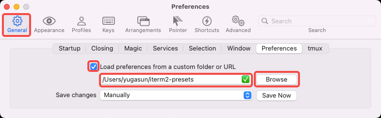

# iTerm2 presets

Yuga's iTerm2 config presets.

## Usage

1. Clone presets

```
git clone https://github.com/yugasun/iterm2-presets ~/iterm2-presets
```

2. Load presets:



Enable `Load preferences from a custom folder or URL`, then browse to select path `~/iterm2-presets/`.

3. Load profiles:


## License

MIT License

Copyright (c) 2022 Yuga Sun
